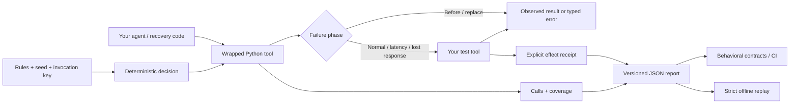

<div align="center">

# ⚡ ToolStorm

### Give your agent a bad day. Before your users do.

Deterministic tool failures · side-effect contracts · strict offline replay

[**Try the interactive lab →**](https://toolstorm-shi1720.sg127977958.chatgpt.site) · [Quickstart](https://toolstorm-shi1720.sg127977958.chatgpt.site/docs) · [Architecture](docs/architecture.md) · [API reference](docs/reference.md) · [Project pitch](docs/portfolio.md)

[](https://github.com/shi1720/toolstorm/actions/workflows/ci.yml)


[](LICENSE)

</div>

Your agent calls a shipping tool. The shipment is created. The response disappears.

The agent retries. It receives a perfectly valid confirmation. **There are now two shipments.**

A response-based success check misses this. ToolStorm injects the lost acknowledgement *after* the tool executes, then checks actual commits. Its bundled lab reproduces the bug, compares three recovery policies, and verifies an idempotent fix.

```text
$ toolstorm demo --scenario lost_ack --policy all

FAIL  The optimist           2 calls · 1 shipment  · no confirmation
FAIL  The retry enthusiast   3 calls · 2 shipments · duplicate effect
PASS  The realist            3 calls · 1 shipment  · idempotent recovery
```

**For:** agent developers writing pytest regressions, tool authors testing retry behavior, and engineers building reproducible failure environments. ToolStorm is a small testing library; your application owns retry, backoff, validation, and idempotency.

## Try it

Python 3.10+. No model, API key, Docker daemon, or runtime dependency is required.

```bash
# Tagged source install. This release is not published on PyPI.
pip install "toolstorm @ git+https://github.com/shi1720/toolstorm.git@v0.1.0"

toolstorm demo --policy all
toolstorm demo --policy resilient --fail-on-contract
```

The [browser lab](https://toolstorm-shi1720.sg127977958.chatgpt.site) executes the **same Python source** in a Pyodide Web Worker. The initial page shows a labeled, previously executed example. Press **Run the storm** to execute all three policies locally. Change the seed, probability, and call budget; inspect calls and contracts; export a run or share its configuration.

## The smallest useful test

```python
from toolstorm import Contract, ResponseLost, Rule, Storm, VirtualClock

storm = Storm(
    [Rule("lost-ack", "ship", "response_lost", calls=(1,))],
    seed=42,
    clock=VirtualClock(),
)
shipments = []
receipts = {}

@storm.tool("ship")
def ship(order: str, key: str):
    if key in receipts:
        return receipts[key]
    shipments.append(order)
    storm.effect("shipment", order)  # Record the actual commit.
    receipts[key] = {"id": len(shipments)}
    return receipts[key]

try:
    ship("order-1729", key="order-1729")
except ResponseLost:
    ship("order-1729", key="order-1729")

Contract(storm.report()) \
    .require_triggered() \
    .no_duplicate_effects() \
    .at_most_calls(2) \
    .assert_valid()
```

Change the second key to `"new-attempt"` and the duplicate-effect assertion fails. [`examples/ambiguous_write.py`](examples/ambiguous_write.py) runs both the broken and corrected controls.

## What it does

| Capability | Useful because |
| --- | --- |
| Six faults with explicit execution phases | A failed read and an acknowledged-lost write require different recovery behavior. |
| Stable seed + independently hashed decisions | Calls to another tool do not shift an existing tool's random schedule. |
| Eligible / selected / triggered coverage | A misspelled target or a post-call fault that never actually fires cannot silently pass. |
| Explicit commit evidence | A successful response cannot hide duplicate effects. |
| Sync and async wrappers | Ordinary Python functions work without an agent-framework dependency. |
| Strict offline replay | Keep the observed boundary behavior as a regression fixture without invoking wrapped live tools. |
| Call budgets and injectable clocks | Bound runaway retries; use virtual time for fast, repeatable sequential tests. |
| Versioned, bounded, redacted JSON | Inspect evidence without pickle, dynamic exception imports, or default exception-message capture. |
| pytest fixture + CLI | Use the library in normal test suites and CI. |

### Six ways to ruin a perfect demo

| Recipe | Failure | What the test reveals |
| --- | --- | --- |
| `lost_ack` | Commit succeeds; acknowledgement is lost | Retrying with a fresh key duplicates a shipment. |
| `rate_limit` | First two inventory reads are rejected | The caller must handle retry hints within its budget. |
| `schema_drift` | Valid JSON contains the wrong field types | Truthy data is not a validated response. |
| `timeout` | First inventory read fails before execution | A bounded read retry can recover. |
| `latency` | Inventory adds 1.4 seconds | Correct results can still violate a latency contract. |
| `blackout` | All inventory reads fail | Bounded, honest failure is the expected outcome. |

The lab compares **scripted recovery policies**, not LLM performance. Timing is declared virtual time, not a speed benchmark. No real shipments are created.

## Record once, replay strictly

```python
from toolstorm import Cassette

Cassette.from_report(storm.report()).save("incident.json")

with Cassette.load("incident.json").replay() as replay:
    offline_ship = replay.tool("ship")(ship)
    try:
        offline_ship("order-1729", key="order-1729")
    except ResponseLost:
        offline_ship("order-1729", key="order-1729")
# Extra, mismatched, or unused calls fail. Wrapped live code never runs.
```

Replay matches signature-bound, **redacted** arguments, in invocation order. Different scrubbed credentials intentionally compare equal. It returns detached copies of recorded outputs. Portable ToolStorm failures retain their types; foreign exceptions become `RecordedToolError`. Effects remain recorded evidence and are **not performed during replay**. See [replay guarantees](docs/replay.md).

```bash
toolstorm demo --policy retry --cassette incident.json
toolstorm inspect incident.json
toolstorm check incident.json --max-calls 8  # exits 1 for duplicate commits
```

### pytest integration

```python
import pytest
from toolstorm import Rule, ToolTimeout

def test_read_recovers(storm_factory):
    storm = storm_factory([Rule("one-time", "read", "timeout", calls=(1,))])

    @storm.tool("read")
    def read():
        return {"ready": True}

    with pytest.raises(ToolTimeout):
        read()
    assert read() == {"ready": True}
# The fixture also verifies every configured rule fired at teardown.
```

Set `require_triggered=False` on the factory only when your test intentionally allows an unexercised rule, such as a probabilistic campaign. Behavioral checks remain explicit.

## How it fits



The library does not retry on your behalf. Wrapping a tool leaves your caller's control flow under test. The [architecture document](docs/architecture.md) covers concurrency, fault selection, serialization, deployment, and the decisions behind this boundary.

## Develop and verify

```bash
git clone https://github.com/shi1720/toolstorm.git
cd toolstorm
python -m venv .venv
source .venv/bin/activate
pip install -e '.[test]'

python -m coverage run --source=toolstorm -m pytest
python -m coverage report --fail-under=90
ruff check src tests examples
mypy src/toolstorm
python examples/ambiguous_write.py
python scripts/bundle_engine.py

# Website: Node 22.13+
npm ci
npm run typecheck
npm run lint
npm run test:engine
npm run build
npm run dev
```

CI tests Python 3.10–3.14, runs the examples, checks types and lint, builds the wheel and website, checks the browser bundle against source, and runs browser interaction tests. The evidence includes deterministic sweeps, property tests, cancellation checks, and regressions from independent adversarial review. See [validation notes](docs/validation.md) for exact scope and known limits.

## Boundaries worth knowing

- **Beta release, `0.1.0`.** It is tested software, not a claim of production adoption or a stable 1.x API.
- Fault decisions are deterministic for a fixed seed and invocation schedule. Model reasoning and arbitrary tool internals are outside that guarantee. Same-tool concurrency needs explicit invocation keys; ordinal filters and rule limits remain order-dependent.
- `response_lost` simulates acknowledgement ambiguity. It does not discover whether a live remote service committed a write.
- A timeout fault is synthetic. The wrapper does not preempt or cancel a hung underlying function.
- Side effects require explicit fixture instrumentation. Unwrapped I/O is outside capture and replay. Use isolated test services.
- Redaction is conservative key/literal filtering, not a general PII detector. Payload capture can be disabled. Use nonsecret rule, tool, and effect identifiers.
- Streaming tools, generators, HTTP interception, distributed traces, model judges, and automatic retry policies are outside this release.

ToolStorm builds on established ideas from fault injection and cassette testing. [Related work and tradeoffs](docs/design.md) explain where this project fits without claiming a new category.

## Contribute

A good contribution contains a real failure mode, a broken control, a corrected control, and evidence that the contract distinguishes them. Start with [CONTRIBUTING.md](CONTRIBUTING.md). [MIT licensed](LICENSE).

Built by [Shivam Gupta](https://github.com/shi1720). Developed with AI assistance and independent adversarial review; implementation claims are backed by the repository's executable tests.
