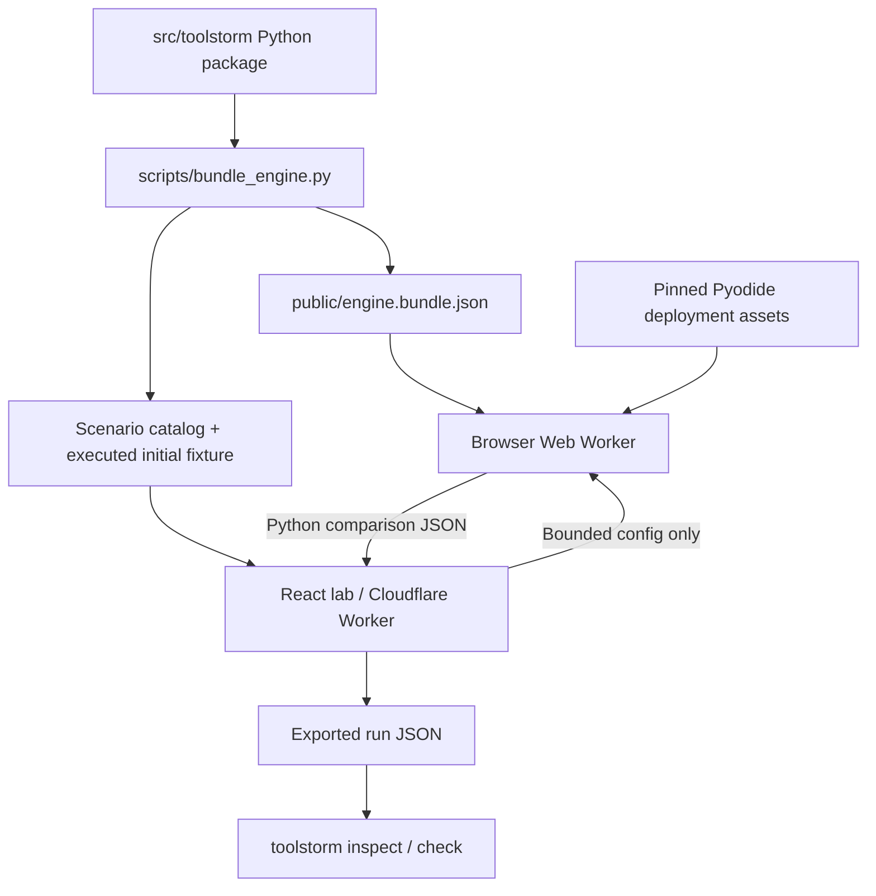

# Architecture and engineering decisions

ToolStorm tests how a caller responds to a tool failure. The fault injector never implements the caller's recovery policy. This separation prevents the test harness from making a broken agent look resilient by quietly retrying for it.

## Components

| Component | Responsibility |
| --- | --- |
| `faults.py` | Validated declarative rules, glob matching, per-rule probability decisions. |
| `engine.py` | Sync/async wrappers, call reservation, execution phase, explicit effects, detached reports. |
| `contracts.py` | Evidence-based assertions with readable failure details. |
| `replay.py` | Bounded cassette parsing, structural/semantic validation, strict offline consumption. |
| `serialization.py` | JSON-only copying, stable encoding, conservative redaction. |
| `clock.py` | Real or virtual requested delay; no wall-clock dependency in demo results. |
| `pytest_plugin.py` | Per-test factory and mandatory fault coverage at teardown. |
| `demo.py` | In-memory shipping service and three application-owned recovery policies. |
| `cli.py` | Demo, inspection, contract checks, machine-readable artifacts. |
| `app/`, `components/` | React/TypeScript lab, recipes, field guide. |
| `public/python-worker.js` | Pyodide worker executing the bundled Python source. |

## Call lifecycle

```mermaid
sequenceDiagram
    participant A as Caller
    participant W as ToolStorm wrapper
    participant T as Test tool
    participant R as Report
    A->>W: call(arguments)
    W->>W: bind signature + defaults
    W->>W: reserve ID / ordinal / key / budget
    W->>W: select first eligible probability hit
    alt Pre-call timeout, rate limit, outage
        W->>R: selected + injected; executed=false
        W-->>A: typed failure
    else Replacement
        W->>R: injected; executed=false
        W-->>A: detached replacement payload
    else Normal, latency, or response lost
        opt Latency
            W->>W: clock.sleep / await clock.asleep
        end
        W->>T: execute exactly once
        opt Instrumented commit
            T->>W: effect(name, logical_key)
            W->>R: effect identity + parent call
        end
        T-->>W: value or real exception
        alt Successful value + response_lost
            W->>R: actual injection recorded
            W-->>A: ResponseLost
        else Other outcome
            W-->>A: original result / exception
        end
    end
    W->>R: terminal call state + elapsed time
```

A post-call rule may be selected but never inject: if the underlying tool raises, there is no successful acknowledgement to drop. The original exception propagates, `selected` increases, `triggered` does not, and `require_triggered()` fails. Rule `limit` bounds **selections**, including a selected post-call fault whose tool fails, so concurrent reservations cannot exceed that limit.

## Deterministic decisions

Each probability draw uses the first 64 bits of:

```text
SHA-256(canonical_json([seed, rule_name, tool_name, invocation_key]))
```

The default invocation key is `#<per-tool ordinal>`. A mutable global random stream would change a tool's schedule whenever another tool consumed a random number. Independent keyed hashes avoid that coupling.

`with storm.invocation("order-17:attempt-1")` supplies a stable logical key. Keys must be unique per tool per session. This stabilizes probability draws when same-tool requests are reordered; **call ordinal filters, rule limits, report ordering, and application behavior still depend on scheduling**. It does not make concurrent software deterministic.

Rules use case-sensitive `fnmatchcase` patterns. Every eligible rule increments `eligible`, including shadowed rules. The first rule which passes its probability and selection-limit checks wins. A real injection increments `triggered` separately from selection. Rule names are unique and should remain stable across regressions.

## State and concurrency

Every call records its currently executing parent when nested. Replay groups call records by their top-level ancestor in linear time. Stubbing a root consumes its recorded subtree; unrelated interleaved roots remain pending.

A `Storm` instance represents one run. There is no global active storm. Decorated functions close over their instance. Counters and effect reservations use an `RLock`; current-call and invocation-key scopes use `ContextVar` tokens restored in `finally`.

Async cancellation propagates as cancellation, not a synthetic normal exception. An inherited context in an unjoined child task cannot log effects after its parent tool completes. Join child tasks before returning from a tool and before taking a report. `report()` is a detached snapshot, intended to be taken after the run has quiesced.

`VirtualClock` accumulates explicitly requested delays and yields once for async sleeps. It is a sequential test clock, not an event scheduler or a concurrent latency model. `RealClock` uses monotonic time. Neither enforces a deadline around live work.

## Observable effects

Call attempts and committed effects are different facts. A fixture calls `storm.effect("shipment", order_id)` immediately after committing the simulated write. Repeated logical keys represent duplicate effects even when a service returns different row IDs.

Effects retain an opaque, per-run equality identity. This prevents redaction from merging distinct private keys and creating false duplicate findings. Raw identity maps are not exported. Targeted effect-count contracts fail closed if identities were redacted, because filtering on the original secret cannot be proven from the exported data. Nonsecret identifiers make reports easier to inspect.

This is instrumentation, not transaction management. ToolStorm cannot detect a side effect that a fixture does not report. Put both fixture-world checks and ToolStorm contracts in important tests.

## Serialization and replay

Inputs are bound against the wrapped signature and defaults are applied, so positional/default/keyword forms normalize. Recorded JSON supports null, booleans, strings, integers, finite floats, lists, string-keyed dictionaries, and tuples normalized to lists. No object `repr()` fallback is used.

Oversized or unsupported **output capture** sets `capture_error` and leaves the successful live result unchanged. Observability must not transform a committed successful write into an exception. Such traces cannot be replayed. Invalid captured inputs fail before execution. `capture=False` allows non-JSON payloads but disables replay.

Cassette readers check structure, schema version, finite durations, contiguous IDs, per-tool ordinals, effect linkage, rule references, execution phases, and coverage consistency. They do not authenticate who authored the file. Replay never dynamically imports exception classes and never falls through to a live wrapped tool.

See [replay.md](replay.md) for matching limitations and exception semantics.

## Website deployment



The server serves the application and assets. There is no arbitrary-code execution endpoint, application database, account system, or API secret. All demo calls run in the visitor's browser against an in-memory service. The build copies the pinned Pyodide runtime from the locked npm dependency into same-origin deployment assets; a load failure is shown with retry instructions. No third-party CDN request is needed to execute a demo. A 90-second worker watchdog and explicit cancellation terminate a stuck browser run.

The initial fixture is generated from Python, labeled as an example, and protected by a source/bundle drift check. UI results belong to the executed configuration; pending configuration changes are visibly marked. Export downloads the selected run. Share links contain only scenario configuration, not a published result.

## Release scope

The core has no runtime dependencies and targets Python 3.10–3.14. The website uses React and Vinext/Cloudflare Workers. Vinext is beta infrastructure; the independently installable Python library is not coupled to its runtime.

The release intentionally excludes production traffic interception, framework-specific runtime hooks, streaming, generators, distributed runners, model judges, and automatic test generation. The extension boundary is ordinary Python callables, rules, and versioned JSON evidence.
